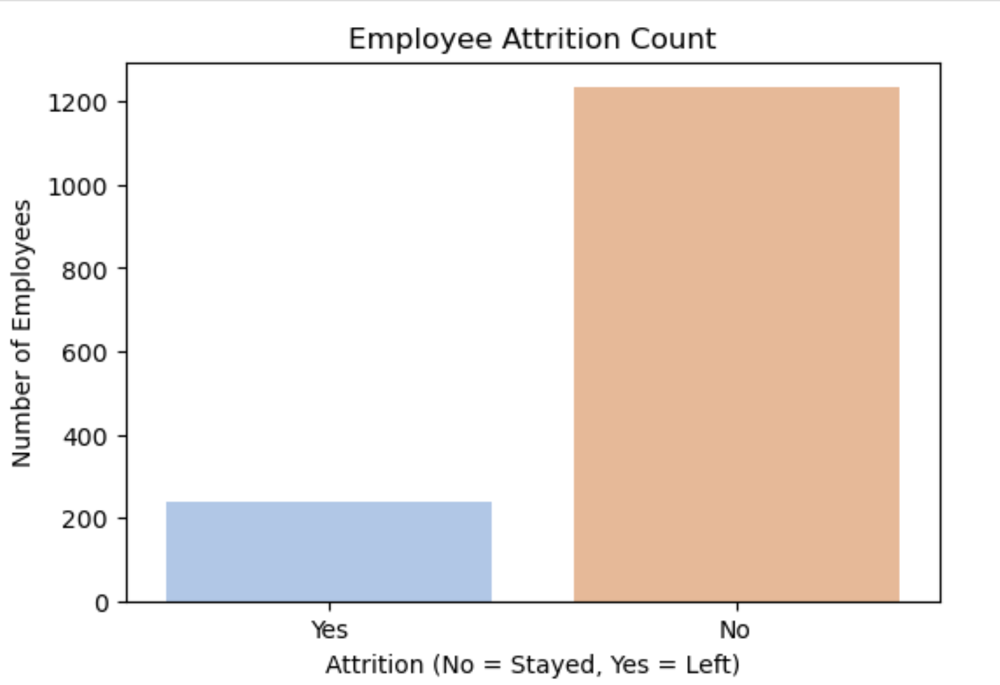
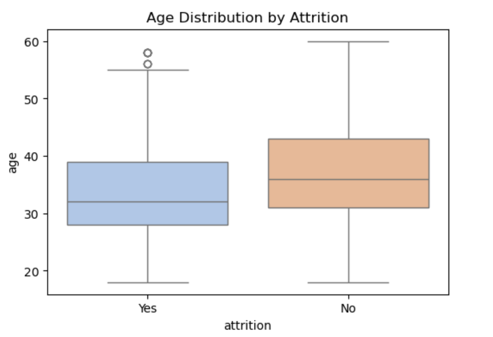
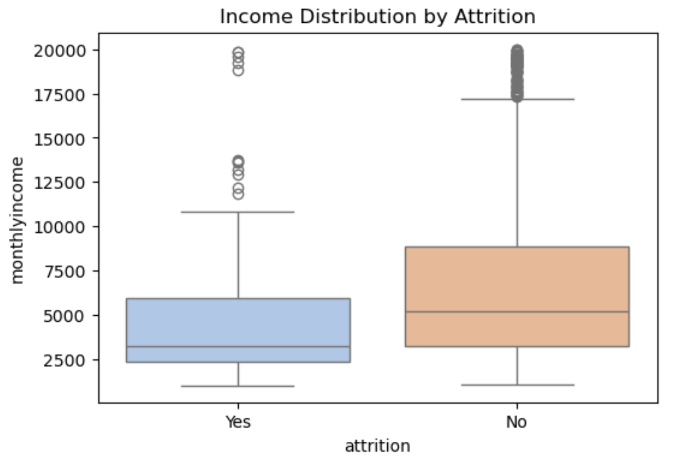
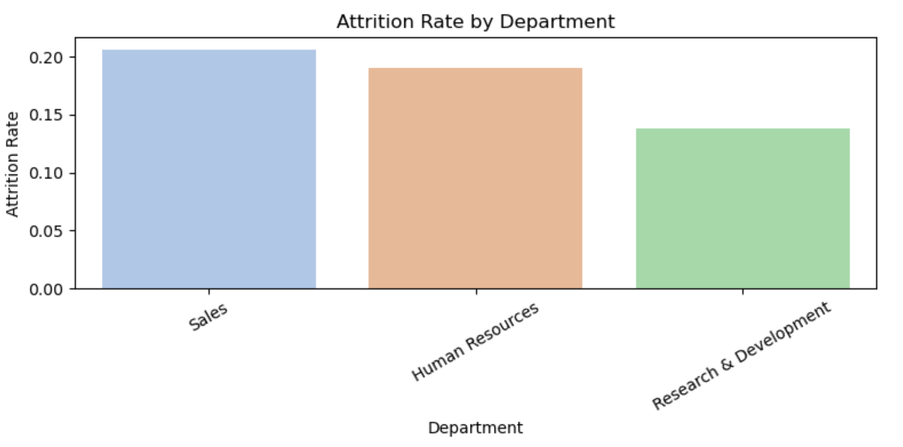
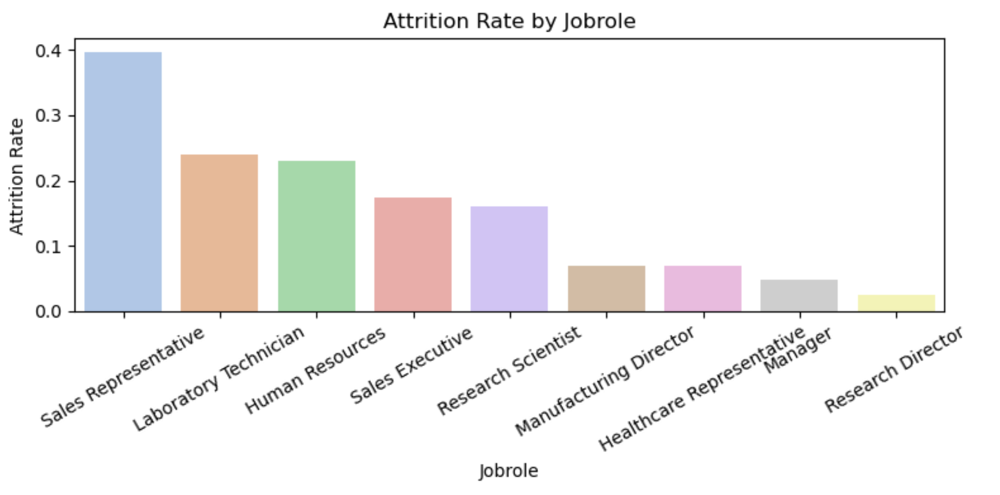
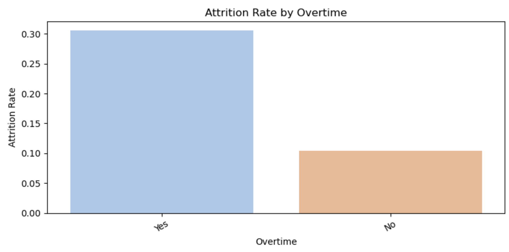
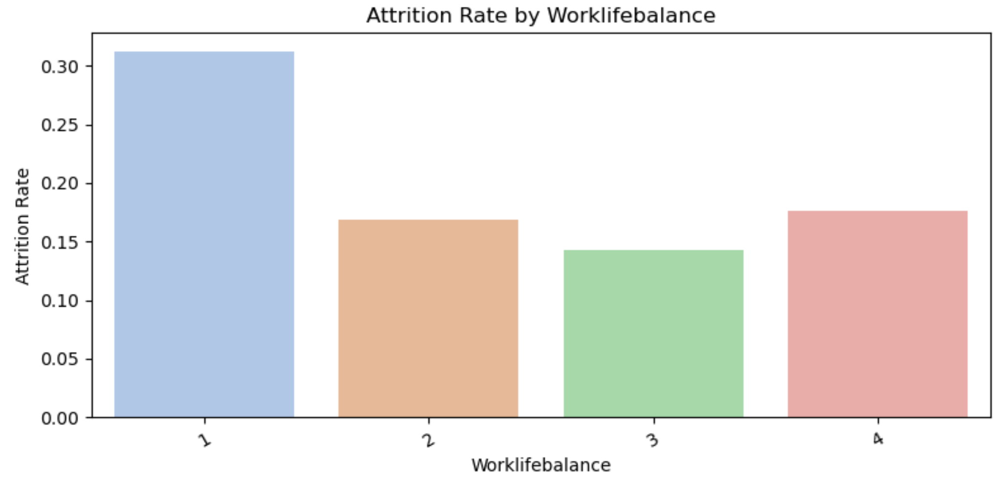
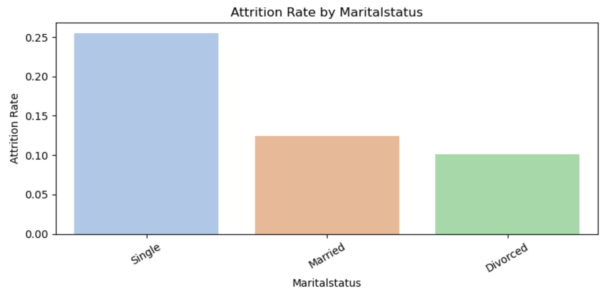
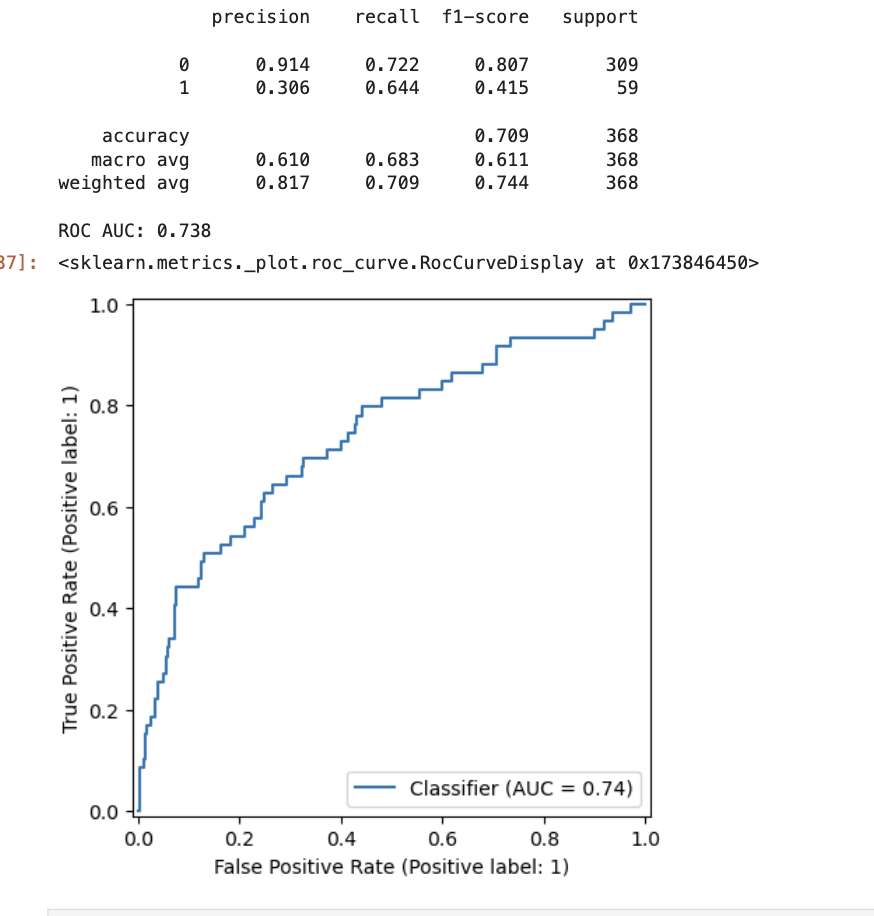
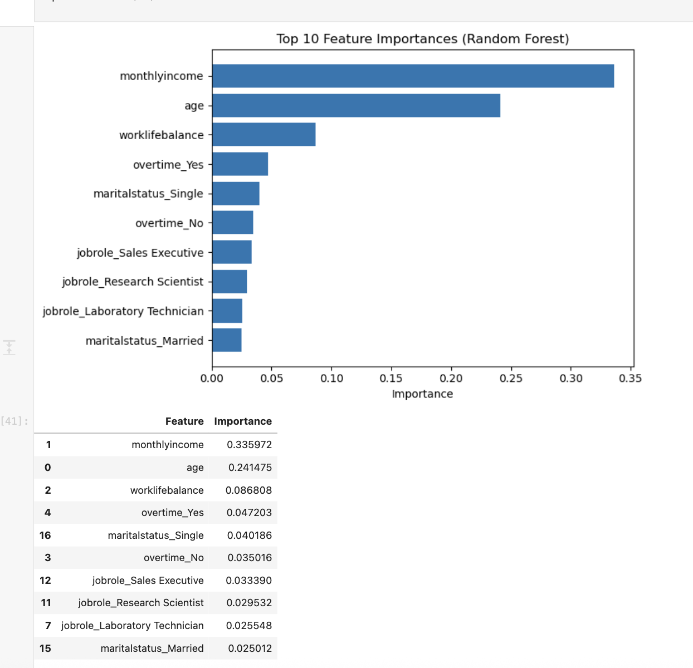

#  HR Analytics: Predicting Employee Attrition (IBM HR)

**Author:** Ismail Ismail  
**Stack:** Python (pandas, seaborn, scikit-learn, matplotlib), Jupyter  
**Goal:** Understand drivers of employee attrition and build models to flag at-risk employees.

---

## 1) Executive Summary

- Overall attrition rate ≈ **16%**.  
- Higher attrition among **younger**, **lower-income**, **single** employees — especially in **Sales** and **HR** roles.  
- **Overtime** and **poor work–life balance** are consistent risk signals.  
- Best early-warning model: **Logistic Regression with class_weight='balanced'** (recall for leavers ≈ **0.64**; AUC ≈ **0.74**).

---

## 2) Dataset

- **Rows:** 1,470 employees • **Columns:** 35  
- **Target:** `attrition_flag` (1 = left, 0 = stayed)  
- **Missing values:** none  
- Cleanups performed: snake_case column names, created numeric target, dropped admin IDs.

---

## 3) Exploratory Analysis (selected visuals)

**Attrition distribution**  

**Age & income by attrition**  
  

**Department & job role**  
  

**Work factors**  
  

**Marital status**  

**Takeaways:** Younger + lower income + overtime + poor work–life balance ⇒ higher turnover; Sales/HR roles are riskier.

---

## 4) Modeling

**Train/test split:** 75/25 with stratification.  
**Features used (baseline):** `age`, `monthlyincome`, `overtime`, `jobrole`, `maritalstatus`, `worklifebalance`.  
**Preprocessing:** `StandardScaler` (numeric) + `OneHotEncoder` (categorical) in a `ColumnTransformer`.

### Results

| Model                        | Accuracy | Recall (Leavers=1) | AUC  |
|-----------------------------|:--------:|:-------------------:|:----:|
| Logistic (unweighted)       |  0.845   |        0.17         | 0.73 |
| **Logistic (balanced)**     |  0.709   |       **0.64**      | **0.74** |
| Random Forest (balanced)    |  0.845   |        0.24         | 0.69 |

**ROC examples**  

### Feature importance (tree model)
Top drivers according to Random Forest: **MonthlyIncome**, **Age**, **WorkLifeBalance**, **Overtime (Yes)**, **MaritalStatus (Single)**.  

**Interpretation:** Financial and lifestyle stressors dominate; organizational context (role/department) adds lift.

---

## 5) Recommendations

1. **Compensation equity:** address lower-income bands within high-risk roles.
2. **Workload & overtime policy:** cap overtime, rotate coverage, monitor burnout signals.
3. **Early-career retention:** mentorship & growth paths for younger staff (esp. Sales/HR).
4. **Targeted monitoring:** use the **balanced logistic model** to flag at-risk cohorts for proactive outreach.

---
